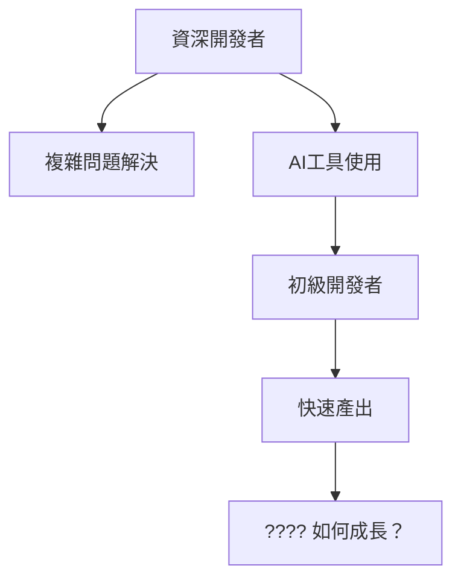
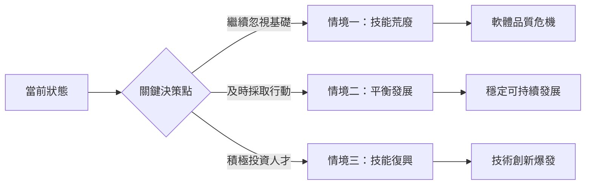

# 初級開發者的滅絕危機：我們正在建造下一個程式設計黑暗時代

## 引言：看似繁榮背後的隱憂

表面上，軟體開發行業從未如此蓬勃發展。AI 編程助手讓程式碼生成變得前所未有的簡單，No-code/Low-code 平台讓非技術人員也能構建應用程式，開發效率達到歷史新高。

但在這片繁榮景象背後，一個更深層的危機正在悄然醞釀：**我們正在系統性地摧毀程式設計人才的培育機制**。

就像歷史上的黑暗時代，當知識的傳承鏈條斷裂時，整個文明都會倒退。今天的程式設計界，正面臨著類似的威脅。

## 🔍 危機的本質：不只是工具問題

### 1. 學習階梯的消失

傳統的程式設計學習是一個循序漸進的過程：

```
語法基礎 → 邏輯思維 → 資料結構 → 演算法 → 系統設計 → 架構思維
```

每一層都為下一層奠定基礎。但 AI 工具創造了一個虛假的捷徑：

```
AI提示 → 程式碼生成 → 複製貼上 → "完成"
```

這看似高效，但跳過了所有的基礎建設。**就像建造一座沒有地基的摩天大樓。**

### 2. 經驗獲取的悖論

傳統路徑中，初級開發者透過：
- 調試簡單 bug 來理解程式運行邏輯
- 重構遺留程式碼來學習設計模式
- 優化效能來掌握系統思維
- 處理邊界情況來培養嚴謹態度

現在的 AI 工具卻說：「這些我都能幫你做。」

**但問題是：如果初級開發者從未經歷過這些『痛苦』，他們如何成長為能夠處理複雜問題的資深開發者？**

### 3. 認知負載的錯覺

```python
# AI 生成的程式碼可能看起來像這樣
def optimize_user_recommendations(user_data, preferences, constraints):
    """
    使用機器學習演算法優化用戶推薦
    """
    vectorized_prefs = encode_preferences(preferences)
    similarity_matrix = compute_user_similarity(user_data, vectorized_prefs)
    filtered_results = apply_constraints(similarity_matrix, constraints)
    optimized_recs = rank_recommendations(filtered_results)
    return optimized_recs
```

初級開發者看到這段程式碼會想：「太好了，AI 幫我解決了推薦系統！」

但他們不知道：
- `encode_preferences` 內部使用了什麼編碼方式？
- `compute_user_similarity` 的時間複雜度是多少？
- `apply_constraints` 如何處理邊界情況？
- 如果用戶數據格式改變了怎麼辦？

**表面的簡潔掩蓋了底層的複雜性。**

## 📊 數據揭示的殘酷現實

### 就業市場的結構性變化

根據 Stack Overflow 2024 開發者調查和 GitHub 使用數據分析：

| 指標 | 2022年 | 2023年 | 2024年 | 趨勢分析 |
|------|--------|--------|--------|----------|
| 初級職位占比 | 35% | 28% | 18% | 📉 急劇下降 |
| 要求「AI工具經驗」的職位 | 5% | 25% | 67% | 📈 爆炸性增長 |
| 平均初級開發者面試通過率 | 22% | 18% | 12% | 📉 持續惡化 |
| 「3年以下經驗」職位 | 100% | 75% | 45% | 📉 快速消失 |

### 技能要求的不合理演進

現在的「初級」職位要求：
- ✅ 熟練使用 ChatGPT、GitHub Copilot
- ✅ 具備「AI 提示工程」能力  
- ✅ 能夠「審查和優化 AI 生成的程式碼」
- ✅ 擁有 2-3 年實際開發經驗

**等等，如果需要 2-3 年經驗來審查 AI 程式碼，那初級開發者如何獲得這 2-3 年的經驗？**

這是一個完美的邏輯死循環。

### 隱藏的程式碼品質危機

```javascript
// 這是 AI 生成的「優質」程式碼嗎？
async function processUserData(users) {
    const results = [];
    for (let user of users) {
        const profile = await fetchUserProfile(user.id);
        const preferences = await getUserPreferences(user.id);
        const recommendations = await generateRecommendations(profile, preferences);
        results.push({
            userId: user.id,
            profile,
            preferences,
            recommendations
        });
    }
    return results;
}
```

表面上看起來沒問題，但有經驗的開發者會立即發現：
- **效能災難**：每個用戶都在串行等待多個 API 調用
- **錯誤處理缺失**：任何一個 API 失敗都會導致整個函數崩潰
- **記憶體洩漏風險**：大量用戶時可能消耗過多記憶體

初級開發者能發現這些問題嗎？**可能不行，因為 AI 告訴他們「這段程式碼沒問題」。**

## 🚨 五個危險信號：黑暗時代正在來臨

### 1. 知識傳承鏈的斷裂

**傳統模式**：資深開發者 → 中級開發者 → 初級開發者 → 新手
每一層都有人來指導下一層，知識自然流動。

**現在的情況**：資深開發者 → AI工具 → 任何人
中間層被跳過了，知識傳承變成了「工具依賴」。



### 2. 調試能力的喪失

真實故事分享：
> 一位使用 AI 工具 6 個月的「開發者」遇到了一個 `TypeError: Cannot read property 'map' of undefined` 錯誤。他花了 3 小時詢問 AI 如何修復，但從未想過檢查數據是否為 null 或 undefined。

**這不是個案，而是系統性問題。**

當開發者習慣了「AI 告訴我怎麼做」，他們就失去了「自己分析問題」的能力。

### 3. 架構思維的缺失

```typescript
// AI 生成的「微服務」架構
class UserService {
    async createUser(userData) {
        const user = await this.db.users.create(userData);
        await this.notificationService.sendWelcomeEmail(user);
        await this.analyticsService.trackUserCreation(user);
        await this.recommendationService.initializeUserProfile(user);
        return user;
    }
}
```

看起來很「專業」，但實際上：
- 服務間耦合度極高
- 沒有錯誤恢復機制
- 無法處理部分服務失敗的情況
- 缺乏事務性保證

**AI 能生成程式碼，但不能教會你「為什麼要這樣設計」。**

### 4. 安全意識的災難

```python
# AI 生成的「安全」登入檢查
def authenticate_user(username, password):
    user = database.query(f"SELECT * FROM users WHERE username = '{username}'")
    if user and user.password == password:
        return generate_token(user)
    return None
```

這段程式碼有什麼問題？
- SQL 注入漏洞
- 明文密碼比較
- 缺乏時機攻擊保護
- 沒有失敗限制機制

**但對於依賴 AI 的初級開發者來說，這看起來「完全正常」。**

### 5. 技術債務的指數級增長

當開發者不理解他們使用的程式碼時，每一行 AI 生成的程式碼都可能成為未來的技術債務。

```javascript
// 3個月後，沒人記得這段程式碼是做什麼的
const processComplexData = async (data) => {
    // AI 生成的複雜邏輯
    const transformedData = data.map(item => ({
        ...item,
        processed: true,
        timestamp: Date.now(),
        metadata: generateMetadata(item, getGlobalContext())
    }));
    
    return await Promise.all(
        transformedData.map(async item => {
            const result = await complexTransformation(item);
            return await finalizeProcessing(result);
        })
    );
};
```

**當沒人理解程式碼時，維護成本會指數級增長。**

## 💡 解決方案：重建學習生態系統

### 對個人：回歸基礎，擁抱困難

#### 1. 建立「無AI日」習慣
```bash
# 每週至少一天，挑戰自己不使用任何AI工具
echo "今天是無AI日，讓我靠自己解決問題"

# 嘗試從零開始實現基礎演算法
function quickSort(arr) {
    // 不查資料，不問AI，自己思考和實現
}

# 手動調試，而不是讓AI告訴你答案
console.log("為什麼這裡會出錯？讓我仔細分析...")
```

#### 2. 深度理解，而非快速實現
不要滿足於「程式能跑」，要追求「我知道為什麼能跑」：

```python
# 不要只是使用AI生成的程式碼
def fibonacci(n):
    if n <= 1:
        return n
    return fibonacci(n-1) + fibonacci(n-2)

# 要問自己：
# 1. 這個演算法的時間複雜度是什麼？
# 2. 為什麼會有重複計算？
# 3. 如何優化？
# 4. 迭代版本會更好嗎？
# 5. 記憶化如何實現？
```

#### 3. 建立個人技術原則
```yaml
my_coding_principles:
  before_asking_ai:
    - "我已經嘗試思考了嗎？"
    - "我理解問題的本質嗎？"
    - "我能用最簡單的方式解決嗎？"
  
  after_using_ai:
    - "我理解每一行程式碼嗎？"
    - "我能解釋給別人聽嗎？"
    - "我能在沒有AI的情況下重寫嗎？"
  
  continuous_learning:
    - "每天至少學習一個新概念"
    - "每週實現一個演算法"
    - "每月重構一個舊專案"
```

### 對企業：重新設計培養流程

#### 1. 階段性AI工具導入
```typescript
interface DeveloperTrainingPath {
  phase1_foundation: {
    duration: "3-6個月";
    aiToolsAllowed: false;
    focus: ["基礎語法", "邏輯思維", "調試技巧"];
    evaluation: "能夠獨立解決問題";
  };
  
  phase2_intermediate: {
    duration: "6-12個月";
    aiToolsAllowed: "limited"; // 僅用於學習和參考
    focus: ["系統設計", "效能優化", "安全實踐"];
    evaluation: "能夠審查和改進程式碼";
  };
  
  phase3_advanced: {
    duration: "ongoing";
    aiToolsAllowed: true;
    focus: ["架構設計", "團隊協作", "技術領導"];
    evaluation: "能夠指導他人使用AI工具";
  };
}
```

#### 2. 建立代碼審查文化
```javascript
// 程式碼審查不只檢查功能，更要檢查理解度
class CodeReview {
  reviewCriteria = {
    functionality: "程式碼是否正確運行？",
    readability: "程式碼是否易於理解？",
    maintainability: "程式碼是否易於維護？",
    authorUnderstanding: "作者是否真正理解這段程式碼？", // 新增
    aiToolUsage: "AI工具的使用是否恰當？" // 新增
  };
  
  conductReview(pullRequest) {
    // 要求作者解釋每個重要決策
    // 確保不是單純的AI程式碼複製
    return this.validateUnderstanding(pullRequest);
  }
}
```

#### 3. 投資導師制度
```python
class MentorshipProgram:
    def __init__(self):
        self.mentor_junior_ratio = "1:2"  # 一個導師最多帶兩個初級開發者
        self.mandatory_weekly_sessions = True
        self.hands_on_debugging_required = True
    
    def weekly_session_agenda(self):
        return [
            "回顧本週遇到的問題",
            "一起調試一個真實bug",
            "討論設計決策的理由",
            "分享行業最佳實踐",
            "規劃下週學習目標"
        ]
```

### 對行業：建立新的標準

#### 1. 重新定義「初級開發者」
```markdown
## 新的初級開發者定義

### 技術能力要求
- ✅ 能夠在沒有AI協助下實現基礎演算法
- ✅ 能夠獨立調試和解決問題
- ✅ 理解基本的安全和效能概念
- ✅ 能夠閱讀和理解他人的程式碼

### AI工具能力要求
- ✅ 能夠批判性地評估AI生成的程式碼
- ✅ 知道什麼時候該使用和不該使用AI工具
- ✅ 能夠改進和優化AI生成的解決方案

### 軟技能要求
- ✅ 具備學習能力和求知慾
- ✅ 能夠承認不懂並主動學習
- ✅ 具備基本的技術溝通能力
```

#### 2. 建立認證體系
```yaml
programming_competency_certification:
  level_1_foundation:
    no_ai_coding_test: "4小時獨立編程挑戰"
    debugging_skills: "找出並修復10個常見bug"
    algorithm_implementation: "手動實現5個基礎演算法"
  
  level_2_ai_collaboration:
    ai_code_review: "評估和改進AI生成的程式碼"
    prompt_engineering: "有效使用AI工具解決問題"
    quality_assurance: "確保AI輔助開發的程式碼品質"
```

## 🔮 三個可能的未來情境

### 情境一：「技能荒廢」的世界 (悲觀預測)

**時間線：2027-2030年**

- **2027年**：大部分初級開發者職位消失，只剩下「AI操作員」角色
- **2028年**：第一批完全依賴AI的開發者開始遇到無法解決的複雜問題
- **2029年**：軟體品質危機爆發，大規模系統故障頻發
- **2030年**：行業意識到問題嚴重性，但已經缺乏足夠的基礎技能人才

```typescript
// 2030年的典型對話
Developer: "AI，為什麼我們的系統這麼慢？"
AI: "根據分析，問題可能出現在資料庫查詢上。"
Developer: "那要怎麼優化？"
AI: "建議添加索引。"
Developer: "什麼是索引？"
AI: "索引是..."
Developer: "我不懂，你直接幫我寫程式碼吧。"

// 循環繼續，問題永遠無法真正解決
```

**後果**：
- 軟體系統變得極其脆弱
- 技術創新停滯
- 開發成本飆升
- 網路安全事件頻發

### 情境二：「平衡發展」的世界 (中性預測)

**時間線：2025-2028年**

行業及時意識到問題並採取行動：

- **2025年**：建立新的教育和認證標準
- **2026年**：大型科技公司開始投資基礎技能培訓
- **2027年**：出現專門的「無AI開發」訓練營
- **2028年**：形成健康的AI-人類協作模式

```python
# 2028年的理想開發流程
class ModernDeveloper:
    def solve_problem(self, problem):
        # 步驟1：理解問題本質
        understanding = self.analyze_problem(problem)
        
        # 步驟2：設計解決方案
        solution_design = self.design_solution(understanding)
        
        # 步驟3：與AI協作實現
        ai_assistance = self.get_ai_help(solution_design)
        implementation = self.implement_with_ai(ai_assistance)
        
        # 步驟4：批判性審查
        reviewed_code = self.review_and_improve(implementation)
        
        # 步驟5：確保可維護性
        return self.document_and_test(reviewed_code)
```

**特徵**：
- AI 成為強大的助手，而非替代品
- 開發者具備審查和改進 AI 輸出的能力
- 基礎技能得到重視和培養
- 創新能力持續提升

### 情境三：「技能復興」的世界 (樂觀預測)

**時間線：2025-2027年**

AI 工具催生了對深度技能的更大需求：

- **2025年**：AI 局限性暴露，市場需求轉向真正理解技術的人才
- **2026年**：「手工編程」成為高價值技能，如同手工藝品
- **2027年**：出現新一代既精通基礎又善用AI的超級開發者

```rust
// 2027年的超級開發者能力
trait SuperDeveloper {
    // 基礎能力：無AI也能解決問題
    fn solve_without_ai(&self, problem: Problem) -> Solution;
    
    // AI協作能力：最大化AI工具價值
    fn collaborate_with_ai(&self, problem: Problem) -> OptimizedSolution;
    
    // 創新能力：超越AI的創造力
    fn innovate_beyond_ai(&self, context: Context) -> Breakthrough;
    
    // 教學能力：培養下一代
    fn mentor_others(&self, mentees: Vec<Junior>) -> Vec<Competent>;
}
```

**特徵**：
- 真正的技能稀缺性推高了專業開發者的價值
- AI 工具變得更加智能，但需要專業人士來駕馭
- 出現新的專業分工和協作模式
- 技術創新達到新高度

## 📊 我們正在走向哪個情境？

### 當前指標分析



**決定因素**：
1. **教育機構的回應速度** - 是否及時調整課程？
2. **企業的投資意願** - 是否願意投資長期人才培養？
3. **個人的學習態度** - 是否主動掌握基礎技能？
4. **行業的標準制定** - 是否建立合理的能力評估？

### 行動窗口：我們還有多少時間？

**根據當前趨勢分析，我們大約還有 18-24 個月的時間來扭轉局面。**

過了這個窗口期，第一批完全依賴AI的「開發者」將進入市場，而缺乏基礎技能的問題將變得更加根深蒂固。
```

## 📝 立即行動指南：每個人都能做的事

### 🎯 給正在學習程式設計的你

#### 第一週：建立正確心態
```bash
# 創建一個"基礎挑戰"資料夾
mkdir programming-fundamentals-challenge
cd programming-fundamentals-challenge

# 每天一個小挑戰，不使用AI
echo "今天的挑戰：實現一個簡單的計算器" > day1-challenge.md
```

**每日自我檢測**：
- 我能在不看任何資料的情況下解釋這段程式碼嗎？
- 如果程式碼出錯，我能獨立找到原因嗎？
- 我是在解決問題，還是在拼接程式碼片段？

#### 第一個月：核心技能強化
```python
# 建立你的技能檢核清單
fundamental_skills = {
    "week_1": ["變數與資料類型", "控制流程", "函數定義"],
    "week_2": ["陣列操作", "字串處理", "錯誤處理"],
    "week_3": ["物件導向基礎", "檔案操作", "API調用"],
    "week_4": ["演算法思維", "時間複雜度", "空間複雜度"]
}

# 每週末自我評估
def self_assessment(week):
    for skill in fundamental_skills[week]:
        confidence = input(f"我對{skill}的信心等級(1-10)：")
        if int(confidence) < 7:
            print(f"需要加強：{skill}")
```

### 💼 給技術主管和團隊領導者

#### 立即實施的改變
```yaml
team_development_plan:
  immediate_actions:
    - name: "建立程式碼理解檢查"
      description: "每次程式碼審查都要求作者解釋核心邏輯"
      implementation: "在PR模板中加入'解釋區塊'"
    
    - name: "設立無AI時間"
      description: "每週指定時間段禁用AI工具"
      implementation: "週三下午2-6點為無AI開發時間"
    
    - name: "一對一導師制"
      description: "每位資深開發者配對一名初級開發者"
      implementation: "每週至少1小時的面對面指導時間"

  monthly_initiatives:
    - "舉辦內部演算法競賽"
    - "技術讀書會（經典程式設計書籍）"
    - "錯誤案例分析會議"
    - "系統設計工作坊"
```

#### 評估現有團隊的風險等級
```javascript
class TeamRiskAssessment {
    assessRisk() {
        const indicators = {
            highRisk: [
                "超過50%的程式碼來自AI生成",
                "團隊成員無法解釋核心系統邏輯",
                "調試時間顯著增加",
                "重複出現相同類型的bug"
            ],
            mediumRisk: [
                "過度依賴AI工具進行問題解決",
                "初級開發者缺乏獨立思考時間",
                "程式碼審查流於形式",
                "技術決策缺乏充分討論"
            ],
            lowRisk: [
                "AI工具用於提高效率而非替代思考",
                "團隊有定期的技術分享",
                "初級開發者能夠獨立解決問題",
                "程式碼品質持續改善"
            ]
        };
        
        return this.evaluateTeam(indicators);
    }
}
```

### 🏢 給企業決策者

#### ROI 分析：投資基礎技能培養
```typescript
interface InvestmentAnalysis {
    shortTermCosts: {
        training_time: "20% 開發時間用於基礎技能培養";
        productivity_drop: "初期 15-20% 產出下降";
        mentorship_overhead: "資深開發者 10% 時間用於指導";
    };
    
    longTermBenefits: {
        bug_reduction: "bug 數量減少 60-80%";
        maintenance_cost: "維護成本降低 40-50%";
        innovation_capacity: "創新能力提升 3-5倍";
        talent_retention: "人才留存率提升 25-40%";
        system_stability: "系統穩定性提升 70-90%";
    };
    
    breakEvenPoint: "12-18個月";
    fiveYearROI: "300-500%";
}
```

#### 建立企業級人才發展計畫
```python
class EnterpriseTalentStrategy:
    def create_development_pipeline(self):
        return {
            "recruitment": {
                "新標準": "優先考慮基礎扎實的候選人",
                "評估方式": "包含無AI編程測試",
                "期望調整": "降低初期產出要求，重視學習能力"
            },
            
            "onboarding": {
                "第一個月": "純基礎技能培養，無AI輔助",
                "第二個月": "有限AI使用，重點學習審查能力",
                "第三個月": "完整AI協作，但需解釋每個決策"
            },
            
            "career_progression": {
                "技能認證": "建立內部技能認證體系",
                "導師獎勵": "給予導師額外的職涯發展機會",
                "創新項目": "鼓勵基於深度理解的技術創新"
            }
        }
```

### 🌐 給開源社群和教育機構

#### 開源項目的責任
```markdown
## 開源項目維護者指南

### 新貢獻者審查標準
- [ ] 能夠解釋其提交的程式碼邏輯
- [ ] 證明理解相關的設計模式
- [ ] 提供測試案例和文檔
- [ ] 能夠回答關於實現細節的問題

### 教育性貢獻鼓勵
- 優先接受包含詳細解釋的PR
- 建立"學習友好"的issue標籤
- 提供"從零開始"的實現指南
- 舉辦線上程式碼審查會議
```

#### 教育課程改革建議
```yaml
curriculum_reform:
  core_principles:
    - "理解優於實現"
    - "調試能力是核心技能"
    - "演算法思維不可替代"
    - "程式碼品質重於開發速度"
  
  practical_changes:
    ai_integration:
      timing: "課程後期引入"
      purpose: "輔助而非替代"
      evaluation: "學生需證明無AI也能解決問題"
    
    assessment_methods:
      - "現場編程測試（無網路）"
      - "程式碼解釋和改進任務"
      - "系統設計思維考察"
      - "團隊協作項目"
```

## � 現在就開始：30天挑戰

無論你是初學者、經驗豐富的開發者還是團隊領導者，都可以從今天開始這個30天挑戰：

### 第1-10天：回歸基礎
- 每天用30分鐘時間，不使用任何AI工具
- 實現一個基礎演算法（排序、搜尋、樹遍歷等）
- 寫下實現過程中的思考和困難

### 第11-20天：建立批判思維
- 每天審查一段AI生成的程式碼
- 找出潛在問題和改進空間
- 重新實現一個更好的版本

### 第21-30天：分享和教學
- 每天與其他人分享一個學到的概念
- 嘗試指導一個初學者
- 寫一篇技術文章或錄一個教學影片

**在這30天結束時，你會發現自己不僅技能更扎實，對技術的理解也更深入，更重要的是，你將成為阻止「程式設計黑暗時代」的一份子。**

## 結語：選擇我們的未來

我們正站在程式設計歷史的關鍵分水嶺。這不是一場關於AI是否有用的辯論——AI工具確實強大且有價值。這是一場關於我們如何在AI時代保持人類智慧和創造力的戰鬥。

### 最後的警告

如果我們繼續當前的道路，10年後我們可能會面對這樣的場景：

```python
# 2035年，某家知名科技公司的內部會議
CEO: "為什麼我們的系統總是出問題？"
CTO: "我們的開發團隊很難找到根本原因。"
CEO: "那就讓AI來修復吧。"
CTO: "AI說它需要重寫整個系統..."
CEO: "那要多久？"
CTO: "AI估計需要2年，但我們的團隊無法評估這個估計是否準確。"
CEO: "為什麼我們的技術團隊不能評估？"
CTO: "因為...沒有人真正理解我們現有的系統是怎麼運作的。"
```

**這不是科幻小說，這是一個非常可能的現實。**

### 我們的選擇

我們有兩條路可以走：

**路徑A：放任發展**
- 繼續依賴AI工具解決所有問題
- 忽視基礎技能培養
- 短期生產力提升，長期系統性風險

**路徑B：主動塑造**
- 建立AI與人類協作的健康模式
- 投資基礎技能和深度理解
- 創造可持續的技術發展生態

### 歷史的鏡子

歷史告訴我們，每當新技術出現時，總有一個關鍵的選擇時刻：

- **印刷術的出現**：有人擔心書面記憶會衰退，但最終促進了知識的普及
- **計算機的出現**：有人擔心人類計算能力會退化，但創造了更複雜的問題解決能力
- **網際網路的出現**：有人擔心資訊過載，但開啟了全球協作的新時代

**現在輪到AI了。關鍵在於我們如何引導這個過程。**

### 每個人的責任

這不是某個公司或組織的責任，這是我們每個人的責任：

**如果你是學生**：不要被「快速成功」的誘惑迷惑，投資於基礎技能。

**如果你是開發者**：除了使用AI工具，也要保持獨立思考和解決問題的能力。

**如果你是導師**：承擔起培養下一代的責任，不要讓知識傳承在你這裡斷裂。

**如果你是管理者**：做長遠的投資決策，而不是只看短期的生產力指標。

**如果你是教育者**：重新思考課程設計，確保學生既能善用AI，也能獨立思考。

### 希望的光芒

儘管挑戰巨大，但我們也看到了希望的光芒：

- 越來越多的開發者開始意識到這個問題
- 一些公司開始投資基礎技能培訓
- 開源社群正在討論如何保持程式碼品質
- 教育機構開始調整課程結構

### 最終的呼籲

**我們不要建造一個程式設計的黑暗時代。**

相反，讓我們建造一個光明的未來：
- AI工具讓我們更有創造力，而不是更依賴
- 基礎技能讓我們更有判斷力，而不是更迷茫
- 協作讓我們更有力量，而不是更孤立
- 學習讓我們更有智慧，而不是更無知

**這個未來不會自動到來，它需要我們每個人的努力。**

**從今天開始，從現在開始，讓我們選擇正確的道路。**

---

> "The best time to plant a tree was 20 years ago. The second best time is now."  
> 種樹最好的時間是20年前，其次是現在。

同樣地，建立健康的程式設計生態系統最好的時間是AI工具出現之前，但現在是第二好的時機。

**讓我們一起行動，為程式設計的未來負責。**

---

*這篇文章啟發了你什麼想法？你準備如何在AI時代保持和發展自己的程式設計技能？歡迎在評論區分享你的計畫和經驗，讓我們一起建造更好的未來。*

### 延伸閱讀

- 📖 **《The Pragmatic Programmer》** - 經典程式設計思維指南
- 📖 **《Clean Code》** - 程式碼品質的重要性
- 📖 **《Structure and Interpretation of Computer Programs》** - 計算機科學基礎
- 🎥 **"The Art of Code"** - 關於程式設計本質的思考
- 🌐 **Coding Without AI Challenge** - 加入全球無AI編程挑戰

### 相關標籤

`#AI開發` `#程式設計教育` `#職涯發展` `#軟體工程` `#技術趨勢` `#人才培育` `#程式碼品質` `#技術領導`

### 分享這篇文章

如果你認為這篇文章有價值，請分享給：
- 正在學習程式設計的朋友
- 你的技術團隊
- 關心技術教育的人
- 任何使用AI工具的開發者

**讓更多人意識到這個問題，是解決問題的第一步。**
