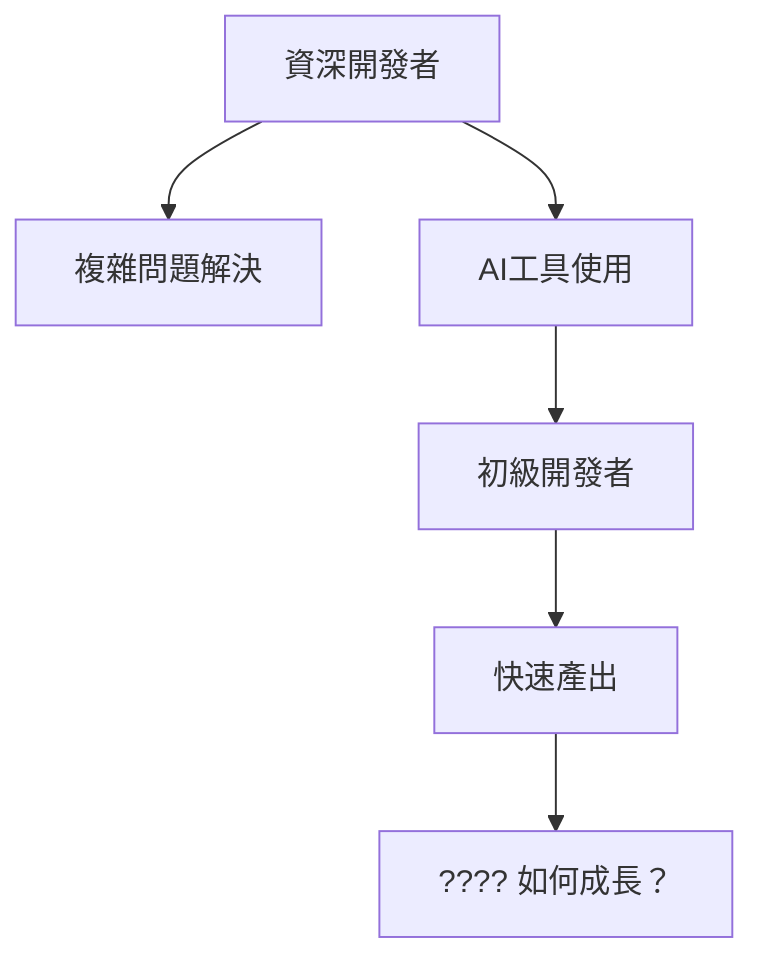

# 初級開發者的滅絕危機：我們正在建造下一個程式設計黑暗時代

## 引言：看似繁榮背後的隱憂

AI 讓寫程式變得超簡單，連不懂技術的人都能用 No-code 平台做出 App。表面上很棒，但其實我們正在破壞整個程式設計人才培養體系。

就像歷史上的黑暗時代一樣，當知識傳承斷掉時，整個文明都會倒退。現在的程式設計界，正面臨同樣的危機。

## 🔍 危機的本質：不只是工具問題

### 1. 學習階梯的消失

傳統的程式設計學習是一個循序漸進的過程：

```
語法基礎 → 邏輯思維 → 資料結構 → 演算法 → 系統設計 → 架構思維
```

每一層都為下一層奠定基礎。但 AI 工具創造了一個虛假的捷徑：

```
AI提示 → 程式碼生成 → 複製貼上 → "完成"
```

這看似高效，但跳過了所有的基礎建設。**就像建造一座沒有地基的摩天大樓。**

### 2. 經驗獲取的悖論

傳統路徑中，初級開發者透過：
- 調試簡單 bug 來理解程式運行邏輯
- 重構遺留程式碼來學習設計模式
- 優化效能來掌握系統思維
- 處理邊界情況來培養嚴謹態度

現在的 AI 工具卻說：「這些我都能幫你做。」

**但問題是：如果初級開發者從未經歷過這些『痛苦』，他們如何成長為能夠處理複雜問題的資深開發者？**

### 3. 認知負載的錯覺

```python
# AI 生成的程式碼可能看起來像這樣
def optimize_user_recommendations(user_data, preferences, constraints):
    """
    使用機器學習演算法優化用戶推薦
    """
    vectorized_prefs = encode_preferences(preferences)
    similarity_matrix = compute_user_similarity(user_data, vectorized_prefs)
    filtered_results = apply_constraints(similarity_matrix, constraints)
    optimized_recs = rank_recommendations(filtered_results)
    return optimized_recs
```

初級開發者看到這段程式碼會想：「太好了，AI 幫我解決了推薦系統！」

但他們不知道：
- `encode_preferences` 內部使用了什麼編碼方式？
- `compute_user_similarity` 的時間複雜度是多少？
- `apply_constraints` 如何處理邊界情況？
- 如果用戶數據格式改變了怎麼辦？

**表面的簡潔掩蓋了底層的複雜性。**

## 📊 數據揭示的殘酷現實

### 就業市場的結構性變化

根據 Stack Overflow 2024 開發者調查，初級職位從 2022 年的 35% 急劇下降到 2024 年的 18%。同時，要求「AI 工具經驗」的職位從 5% 爆增到 67%。更誇張的是，初級開發者面試通過率持續惡化，從 22% 降到 12%。

### 技能要求的不合理演進

現在的「初級」職位要求：
- ✅ 熟練使用 ChatGPT、GitHub Copilot
- ✅ 具備「AI 提示工程」能力  
- ✅ 能夠「審查和優化 AI 生成的程式碼」
- ✅ 擁有 2-3 年實際開發經驗

**等等，如果需要 2-3 年經驗來審查 AI 程式碼，那初級開發者如何獲得這 2-3 年的經驗？**

這是一個完美的邏輯死循環。

### 隱藏的程式碼品質危機

```javascript
// 這是 AI 生成的「優質」程式碼嗎？
async function processUserData(users) {
    const results = [];
    for (let user of users) {
        const profile = await fetchUserProfile(user.id);
        const preferences = await getUserPreferences(user.id);
        const recommendations = await generateRecommendations(profile, preferences);
        results.push({
            userId: user.id,
            profile,
            preferences,
            recommendations
        });
    }
    return results;
}
```

表面上看起來沒問題，但有經驗的開發者會立即發現：
- **效能災難**：每個用戶都在串行等待多個 API 調用
- **錯誤處理缺失**：任何一個 API 失敗都會導致整個函數崩潰
- **記憶體洩漏風險**：大量用戶時可能消耗過多記憶體

初級開發者能發現這些問題嗎？**可能不行，因為 AI 告訴他們「這段程式碼沒問題」。**

## 🚨 五個危險信號：黑暗時代正在來臨

### 1. 知識傳承鏈的斷裂

**傳統模式**：資深開發者 → 中級開發者 → 初級開發者 → 新手
每一層都有人來指導下一層，知識自然流動。

**現在的情況**：資深開發者 → AI工具 → 任何人
中間層被跳過了，知識傳承變成了「工具依賴」。



### 2. 調試能力的喪失

真實故事分享：
> 一位使用 AI 工具 6 個月的「開發者」遇到了一個 `TypeError: Cannot read property 'map' of undefined` 錯誤。他花了 3 小時詢問 AI 如何修復，但從未想過檢查數據是否為 null 或 undefined。

這不是個案，而是普遍現象。大家習慣了「AI 告訴我怎麼做」，就失去了自己分析問題的能力。

### 3. 架構思維的缺失

```typescript
// AI 生成的「微服務」架構
class UserService {
    async createUser(userData) {
        const user = await this.db.users.create(userData);
        await this.notificationService.sendWelcomeEmail(user);
        await this.analyticsService.trackUserCreation(user);
        await this.recommendationService.initializeUserProfile(user);
        return user;
    }
}
```

看起來很「專業」，但實際上：
- 服務間耦合度極高
- 沒有錯誤恢復機制
- 無法處理部分服務失敗的情況
- 缺乏事務性保證

**AI 能生成程式碼，但不能教會你「為什麼要這樣設計」。**

### 4. 安全意識的災難

```python
# AI 生成的「安全」登入檢查
def authenticate_user(username, password):
    user = database.query(f"SELECT * FROM users WHERE username = '{username}'")
    if user and user.password == password:
        return generate_token(user)
    return None
```

這段程式碼有什麼問題？
- SQL 注入漏洞
- 明文密碼比較
- 缺乏時機攻擊保護
- 沒有失敗限制機制

**但對於依賴 AI 的初級開發者來說，這看起來「完全正常」。**

### 5. 技術債務的指數級增長

當開發者不理解他們使用的程式碼時，每一行 AI 生成的程式碼都可能成為未來的技術債務。

```javascript
// 3個月後，沒人記得這段程式碼是做什麼的
const processComplexData = async (data) => {
    // AI 生成的複雜邏輯
    const transformedData = data.map(item => ({
        ...item,
        processed: true,
        timestamp: Date.now(),
        metadata: generateMetadata(item, getGlobalContext())
    }));
    
    return await Promise.all(
        transformedData.map(async item => {
            const result = await complexTransformation(item);
            return await finalizeProcessing(result);
        })
    );
};
```

**當沒人理解程式碼時，維護成本會指數級增長。**

## 💡 解決方案：重建學習生態系統

### 對個人：回歸基礎，擁抱困難

偶爾練習「不用 AI」寫程式。每週至少一天，挑戰自己不使用任何 AI 工具，嘗試從零開始實現基礎演算法，手動調debug。

不要滿足於「程式能跑」，要追求「我知道為什麼能跑」。遇到問題先自己想，用了 AI 之後要確保自己理解每一行程式碼，能解釋給別人聽，甚至在沒有 AI 的情況下重寫。

建立學習習慣：每天至少學一個新概念，每週實現一個演算法，每月重構一個舊專案。

### 對企業：重新設計培養流程

不要一開始就讓新手用 AI 工具。建議分階段進行：前 3-6 個月專注基礎語法、邏輯思維、調試技巧，完全不用 AI；接下來 6-12 個月有限度使用 AI，重點學習系統設計、效能優化；最後才完全開放 AI 工具，但要求能指導別人。

程式碼審查不只檢查功能，更要檢查理解度。要求作者解釋每個重要決策，確保不是單純的 AI 程式碼複製。

投資導師制度，讓資深開發者帶新手，一對一指導，每週至少一小時面對面討論。


### 對行業：建立新的標準

所謂「初級開發者」的定義，其實也該與時俱進。現在的初級開發者，除了要能自己寫出基本演算法、獨立 debug、懂得安全和效能的基本概念，也要能看懂別人的程式碼。更重要的是，面對 AI 工具產生的程式碼，你要能批判性地思考，知道什麼時候該用、什麼時候不該用，甚至還要能優化 AI 給你的答案。

軟技能也很重要。你要有學習的動力，遇到不懂的地方敢於承認並主動學習，還要能把技術想法講清楚，和團隊溝通。

行業也該建立一套認證體系，讓大家有機會證明自己的基礎能力。比如說，最基礎的等級可以要求你在沒有 AI 幫忙的情況下，獨立完成一場編程挑戰、找出 bug、手動寫出幾個經典演算法。進階一點的，則是要你能審查和改進 AI 產生的程式碼，懂得怎麼下 prompt，確保 AI 幫你寫的東西真的夠好。

## 三個可能的未來

### 情境一：技能荒廢的世界（悲觀預測）

如果我們什麼都不做，2027 年初級開發者職位可能完全消失，只剩下「AI 操作員」。2028 年開始，完全依賴 AI 的開發者會遇到無法解決的複雜問題。2029 年軟體品質危機爆發，大規模系統故障頻發。

想像一下 2030 年的對話：開發者問 AI「為什麼系統這麼慢？」AI 說「可能是資料庫問題，建議加索引。」開發者問「什麼是索引？」AI 開始解釋，開發者說「我不懂，你直接幫我寫程式碼吧。」問題永遠無法真正解決。

結果就是軟體系統變得極其脆弱，技術創新停滯，開發成本飆升，網路安全事件頻發。

### 情境二：平衡發展的世界（中性預測）

如果行業及時意識到問題，2025 年建立新的教育和認證標準，2026 年大型科技公司開始投資基礎技能培訓，2027 年出現專門的「無 AI 開發」訓練營，2028 年形成健康的 AI-人類協作模式。

這種情況下，AI 成為強大的助手而不是替代品，開發者具備審查和改進 AI 輸出的能力，基礎技能得到重視，創新能力持續提升。

### 情境三：技能復興的世界（樂觀預測）

最理想的情況是，AI 工具反而催生了對深度技能的更大需求。2025 年 AI 局限性暴露，市場轉向真正理解技術的人才。2026 年「手工編程」成為高價值技能，就像手工藝品一樣。2027 年出現新一代既精通基礎又善用 AI 的超級開發者。

真正的技能稀缺性推高了專業開發者的價值，AI 工具變得更智能但需要專業人士來駕馭，出現新的專業分工，技術創新達到新高度。

## 我們還有多少時間？

根據當前趨勢分析，大概還有 18-24 個月的時間來扭轉局面。過了這個窗口期，第一批完全依賴 AI 的「開發者」就會進入市場，缺乏基礎技能的問題會變得更嚴重。

決定因素包括教育機構是否及時調整課程、企業是否願意投資長期人才培養、個人是否主動掌握基礎技能，以及行業是否建立合理的能力評估標準。

## 現在就開始行動

### 30 天挑戰

第 1-10 天：回歸基礎。每天用 30 分鐘不使用任何 AI 工具，實現一個基礎演算法，寫下實現過程中的思考和困難。

第 11-20 天：建立批判思維。每天審查一段 AI 產生的程式碼，找出潛在問題和改進空間，重新實現一個更好的版本。

第 21-30 天：分享和教學。每天與其他人分享一個學到的概念，嘗試指導一個初學者，寫一篇技術文章。

30 天結束時，你會發現自己不僅技能更扎實，對技術的理解也更深入，更重要的是，你將成為阻止「程式設計黑暗時代」的一份子。

## 結語：選擇我們的未來

我們正站在程式設計歷史的關鍵時刻。這不是在討論 AI 好不好用（AI 工具確實很強大），而是在思考如何在 AI 時代保持人類的智慧和創造力。

### 最後的警告

如果我們繼續這樣下去，10 年後可能會出現這樣的場景：CEO 問「為什麼系統總是出問題？」CTO 說「開發團隊找不到根本原因。」CEO 說「那讓 AI 來修吧。」CTO 說「AI 要重寫整個系統，但我們無法評估這個估計準不準確，因為沒人真正理解現有系統怎麼運作。」

這不是科幻，這是很可能的現實。

### 我們的選擇

我們有兩條路：一是放任發展，繼續依賴 AI 解決所有問題，短期提升生產力但長期風險很大。二是主動塑造未來，建立 AI 與人類協作的健康模式，投資基礎技能和深度理解。

歷史告訴我們，每當新技術出現時，都有關鍵的選擇時刻。印刷術、電腦、網際網路都曾讓人擔心，但最終都促進了人類發展。現在輪到 AI 了，關鍵在於我們怎麼引導這個過程。

### 每個人的責任

這不是某個公司的責任，而是我們每個人的責任。如果你是學生，別被「快速成功」誘惑，要投資基礎技能。如果你是開發者，除了用 AI 工具，也要保持獨立思考和解決問題的能力。如果你是導師，要承擔起培養下一代的責任。如果你是管理者，要做長遠投資而不只看短期效益。

儘管挑戰很大，我們也看到希望：越來越多開發者意識到問題，一些公司開始投資基礎技能培訓，開源社群在討論程式碼品質，教育機構開始調整課程。

我們不要建造程式設計的黑暗時代。相反，讓我們建造光明的未來：AI 工具讓我們更有創造力而不是更依賴，基礎技能讓我們更有判斷力而不是更迷茫，協作讓我們更有力量而不是更孤立。

這個未來不會自動到來，需要我們每個人的努力。從今天開始，讓我們選擇正確的道路。

種樹最好的時間是 20 年前，其次是現在。建立健康的程式設計生態系統也是如此。讓我們一起行動，為程式設計的未來負責。
